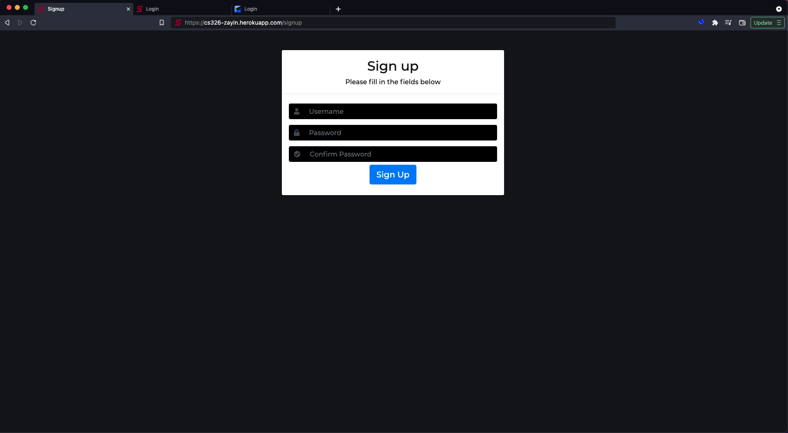

# Final

# Team
Team Zayin

# Application Name
Spazz

# Semester
Fall 2021

# Overview
Spazz is a web application that enables users to stream and view live ameatur sports. Spazz brings the game to your laptop allowing our users to never have to leave their comfort zone. With low latency streaming and interactive chat, we provide a collaborative space for sport fans to get together. Currently, there is no way for sport fans to tune into amateur sporting events and Spazz hopes to fix this problem.

# Team Members
Kyle Bouvier, Shiv Ansal, Mihir Thakur

# User Interface

## Sign-In Page (/login)
This page takes a username and password via text input from the user. Uses this information to make a login attempt. If successful, redirects to /sports. If unsuccessful, displays an error message.


## Sign-Up Page (/signup)
This page takes a username, password, password confirm via text inout from the user. This information is used to attempt to register a new user account on the site. If successful, redirects to /sports. If unsuccessful, displays and error message.



## Sports Page (/sports)
The Sports Page includes a grid menu of all the sports that categories that can be live streamted on SPAZZ. Clicking on any of the grid menu items redirects the user to the category page of the chosen category.


## Category Page (/stream/browse?category=categoryname)
Each sport has a seperate category page. This page displays each of the currently running live streams in that specific category. Clicking on the thubmnail or title of a livestream displayed in the grid, will redirect to the /live page for that specific stream.


## Stream Page (/live/{username})
This page contains the live video feed for a specific user. The number of current viewers and whether the stream is currently live is indicated directly below the live stream window. Additonally, this page contains a live chat feed that viewers can use to communicate with eachother and the streamer.


## User Page (/user)
Essentially a profile page, the User page includes the users's username, profile picture URL, stream link, stream category and stream key. This page also allows user to update their stream and profile details such as stream title, stream category, stream thumbnail, and profile picture via the "Configure Your Stream" and "Configure Your Profile" buttons.


## Navigation Bar
The navigation bar includes several buttons:
1. "SPAZZ": It is the title of the website and redirects to the sports page
2. "Sports": redirects to the sports page
3. "Browse": Opens a drop-down menu including all available sports categories. Clicking on a category redirects to the category page of the category selected
4. "Sign in Button" Redirects to the login page. If the user is already logged in, this button is replaced with the user's profile picture and username which can be clicked to access a dropdown menu.

## 404 Page
404 Page appears when a 404 error occurs. Includes a description of the 404 error.

# APIs
User API  

    GET /signup
	    View endpoint that renders signup.html
	
	POST /signup
        Description: Create a new account at spazz
        Required body paramaters
            1. username <String>: The username to attempt signup with (must be unique)
            2. password <String>: The password to attempt signup with
		Allows new user to sign up
        1. Checks that req.body.username is unique
        2. Adds new User object to DB.users
        3. Additionally inserts a corresponding `Stream` document with the same username and default properties into DB.Streams
        4. Returns JSON response {success: <Boolean>, error: <String>, redirectUrl: <String>}, the error field will contain an error message if user creation failed

    GET /login
		Description: View endpoint that renders login.html

	POST /login
        Description: Login to Spazz
        Required body parameters
            1. username <String>: The username to attempt login with 
            2. password <String>: The password to attempt signup with
        1. Perform authentication with req.body.username and req.body.password
        2. Returns JSON response {success: <Boolean>, error: <String>, redirectUrl: <String>}, the error field will contain an error message if login failed

    GET /logout
        Description: Logs out an authenticated user, then redirects to /login

	GET /user/info?username=
        Description: Get details for a specific user account
        Required Query string arguments
            1. username <String>: The username to get user info from
        1. If the request is authenticated, returns a JSON response containing ALL information in the `user` document with username field equal to req.query.username
        2. If the request is unauthenticated, returns a JSON response containing only the non sensitive information in the `user` document with username field equal to req.query.username

    GET /user
		Description: View endpoint that renders ‘user.html’
        1. Request must be authenticated, otherwise redirects to '/login'

	POST /user/update
        Description: Update an existing user account/document
        Optional body parameters
            1. profilepic <String>: URL of an image to set as the current user.profilepic 
        1. Request must be authenticated
        2. Return a JSON response {success: <Boolean>, error: <String>}, success === true if update was successful, false otherwise, error contains an error message of what went wrong if failed

Stream API

	POST /stream/update
        Description: Update an existing stream document
        Required body parameters
            1. username <String>: The username of stream document owner
        Optional body parameters
            1. category <String>: Category to set as stream.category
            2. title <String>: Title to set as stream.title
            3. thumbnail <String>: Thumbnail URL to set as stream.thumbnail
        1. Return a JSON response {success: <Boolean>, error: <String>}, success === true if update was successful, false otherwise, error contains an error message of what went wrong if failed
		
	GET /stream/get?category=&username=&live=
		Description: Returns all stream documents with matching category, username, and live fields as specificed in the query string arguments
        Optional query arguments
            1. category <String>: Used to find stream documents with matching stream.category field
            2. username <String>: The username of the user who the stream belongs to
            3. live <Boolean>: Used to find stream documents with matching stream.live field
        1. Returns a JSON response {streams: Array<<Stream>>}, the streams field contains an array of streams that matched the query

    GET /stream/browse?category=xxx
		Description: View endpoint that renders ‘category.html’

Sports API

    GET /sports/get
	    Description: Used to get all the existing sports documents
        1. Returns a JSON response {sports: Array<<Sport>>}, sports field contains an array of all sports documents stored in the DB

	GET /sports
		Description: View endpoint that renders sports.html

Live API

	GET /live/{username}
		Description: View endpoint that renders ‘stream.html’

Websockets (for Node-Media-Server)

	/prePublish
        Description: Fired when a user attempts to start a new stream from an RTMP client. This endpoint isn't directly invoked by the user.
        Required Arguments
            1. id <String>: Used for NMS lookup of RTMP session
            2. StreamPath <String>: Path of the stream
            3. key <String>: Stream key
        1. Get the username from the stream path
        2. Verify that a `User` document exists in DB.Users exists with this username
        3. If so, Get streamkey from args.key and verify it with the one stored in the `User` document
        4. If both of these checks succeed the stream is allowed to go live, otherwise it is rejected

Websockets (for stream chat)&nbsp;

	Server side
	/chat/connection?streamer_username=xxx
        Description: Fires when user joins a stream chat
        Required query arugments:
            1. streamer_username <String>: username of the stream whose chat you wish to connect
        1. The streamer_username argument is used to perform a lookup in the Stream collection to determine if this stream exists
        2. If the stream exists then the socket is added to the corresponding socket.io room, and stream.viewers is incremented
			
		/chat/{room_name}/chatMessage, arguments: {msg: Message}
			Fires when a user sends a chat message in `{room_name}` chat room. Will emit an event to all sockets in that room with the username of sender and msg

    /chat/{room}/disconnect
        Description: Fires when a socket disconnects from a specific room
	    1. Gets the ‘Stream’ document from the Stream collection corresponding to the chat that the user was in.
        2. Decrements the viewers field

    /chat/{room}/chatMessage
        Description: Fires when a chat message is sent to a specific room
        Required Arguments:
            1. {msg: <String>} contains the chat message to be sent
        1. Will broadcast this message contained in msgObj.msg to other clients in the chat room

	Client side
	/chat/{room}/chatMessage
        Description: Fired when the server accepts a chat message
        Required Arguments: 
            1. {username: <String>, msg: <String>}: username: sender of the message, msg: the chat message
        1. Client will update the chat by adding a new message with username = username, message = msg

    /chat/{room}/loadMessages
        Description: Fired when the server wishes for the client to load a list of messages into the chat window
        Required Arguments:
            1. Array<{username: <String>, msg: <String>}>: Array of username, message pairs
        1. Client will update the chat by adding the list of messages supplied in the array

Misc API

    GET /*
    Description: Redirects to sports page for an invalid link

    GET /404
    Description: View endpoint that renders '404.html'

# Database
MongoDB collections: user, stream, sport

```
user document
{
	_id: <ObjectId1>,
    username: <String> //user's username,
    hash: <String> //sha512 hashed password,
    salt: <String> //used for hashing passwords,
    stream_key: <String> //secret unique key used for streaming verification,
    profilepic: <String> //url to a profile picture image
}

stream document 
{
        _id: <ObjectId1>,
        username: <String> //stream owner's username,
        title: <String> //title of the stream,
        category: <String> //sports category of the stream,
        live: <Boolean> //true=stream is live, false = not live,
        viewers: <Integer> //number of viewers currently watching,
        chat: <Array<Object>> //array of chat message objects: {username: <String>, msg: <String>}
        thumbnail: <String> //img src to display on /browse
}


sport document
{
    _id: <ObjectId1>,
    name: <String> //used to identify the sports category 'basketball', 'football', etc,
    image: <String> //url for thumbnail images to display on /sports page
}
```

# URL Routes/Mappings
1. get('/signup'): get request for the signup page
2. post('/signup'): post request to post and register new users
3. get('/404'): get request for the 404 page
4. get('/login'): get request for the login page
5. post('/login'): post request with the login information of the user. Returns authentication success or faliure. if successful, it redirects the logged in user to sports page. If unsuccessful, it keeps the user at login page.
6. get('/logout'): logs out the user and redirects to login page.
7. get('/user/info'): get request to retrieve username, stream_key, profilepic, stream_title, stream_category,stream_thumbnail: streamRes.thumbnail
8. get('/user/update') AUTHENTICATED: post request to update the user's profile picture link
9. get('/user') AUTHENTICATED: Confirms the user is authorized. If not we would normally redirect Otherwise renders user page.
10. post('/stream/update') AUTHENTICATED: post request to update the user's stream title, stream category, stream thumbnail.
11. get('/stream/browse'): gets the category page for a specific sports category
12. get('/sports/get'): get request to get the list of available sports
13. get('/sports'): get request to redirect to the sports page
14. get('/live/:username'): get request to redirect to the stream page of the specific user
15. get('*'): get request to redirect to sports page for an invalid link


# Final Rubric

### General &emsp; &emsp; &emsp; &emsp; &emsp; ___ / 25 pts

- Authentication
  - Successfully create a user through sign up
  - Successfully login a user
  - Only able to see profile picture in top right corner when logged in
- Routing
- Linting/ code style

### Sports Page &emsp; &emsp; &emsp; &emsp; &emsp; ___ / 10 pts
- Successfully view all valid sport offerings on the platform
- Successfully click each sport and get redirected to appropriate stream browsing page 

### User Page &emsp; &emsp; &emsp; &emsp; &emsp; ___ / 20 pts
- Successfully access user page when logged in
- Successfully change user image 
- Successfully edit stream information details 

### Browse Stream page &emsp; &emsp; &emsp; &emsp; &emsp; ___ / 15 pts
- Successfully view all current livestreams for each respective sport 
- Successfully get redirected to the correct live page when clicking on a stream

### Livestream Page &emsp; &emsp; &emsp; &emsp; &emsp; ___ / 25 pts
- Successfully view livestream and current viewer count 
- Successfully read and send messages to stream chat 
- Successfully deploy your stream using stream client + steam key (for streamers only)

### CRUD &emsp; &emsp; &emsp; &emsp; &emsp; &emsp; &emsp; &emsp; &emsp;  ___ / 5 pts									
- Create: **1 pt**
  - User
  - Stream
- Read: **2 pt**
  - Read valid sport categories on the platform
  - Read user stream key, image, name, password hash and salt
  - Grab current live streams 
  - Read stream category, title, thumbnail, viewers, chat object,
- Update: **2 pt**
  - Edit user profile picture
  - Update stream to indicate currently live or offline
  - Update stream thumbnail, live stream chat object, viewer count, and category

### &emsp; &emsp; &emsp; &emsp; &emsp; &emsp; &emsp; &emsp; &emsp; &emsp; &emsp; &emsp; &emsp; &emsp; &emsp; Total:  ___ / 100 points
