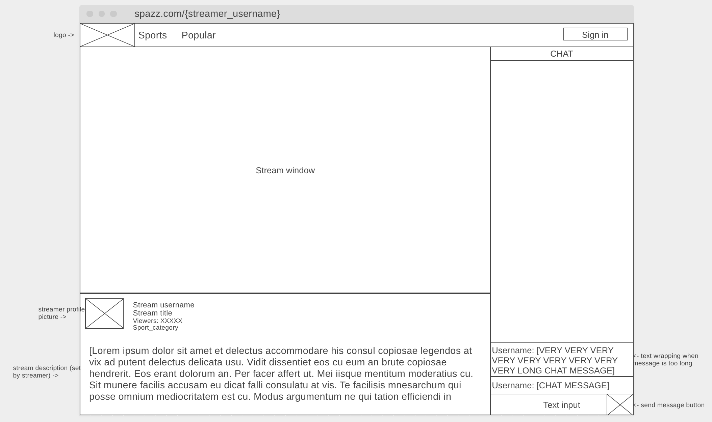
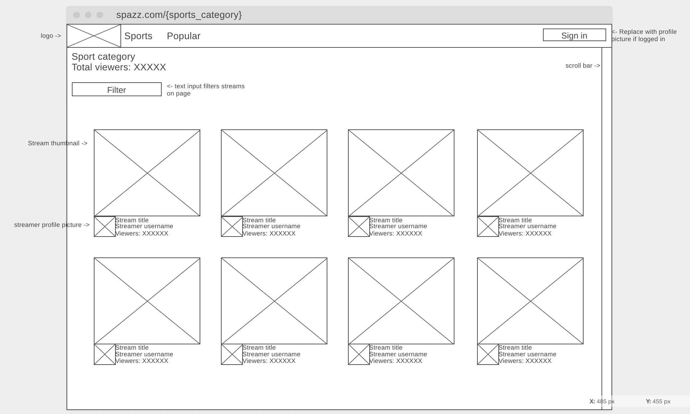

# milestone 1
## Team Name
cs326-final-zayin
 
## Application Name
Spazz
## Team Overview
* Shiv Ansal @shivansal 
* Kyle Bouvier @kite418 
* Mihir Thakur @beepbeepbob 
 
## Innovative Idea
Spazz is a web application that enables users to stream and view live ameatur sports. Spazz brings the game to your laptop allowing our users to never have to leave their comfort zone. With low latency streaming and interactive chat, we provide a collaborative space for sport fans to get together. Currently, there is no way for sport fans to tune into amateur sporting events and Spazz hopes to fix this problem. 
 
## Important Components/Data Interactions
* Video Streaming for amatuer website
* Score keeping for the live games
* Community building tools such as direct and group chats 
* Authentication system for creation/management of user account
* Control panel for managing stream settings

# wireframes
Stream Page

Sports/Browse Page

Category Page

All our wireframe work has been logged on the link below
https://wireframe.cc/pro/pp/7a15c07e8483899

# HTML screenshots
All HTML screenshots are included in "./../assets/milestone_1_ss"

# Work Destribution

Mihir: Worked on designing and debugging the stream page
Kyle: Worked on wireframe, designed and debugged category page
Shiv: Worked on designing and debugging the sports page
